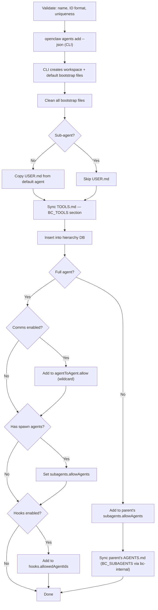
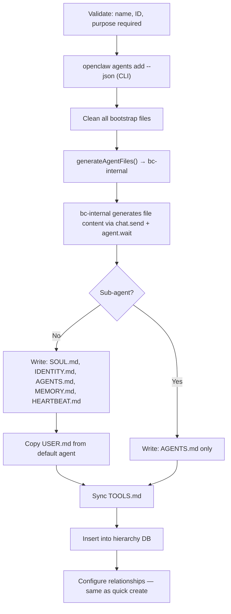
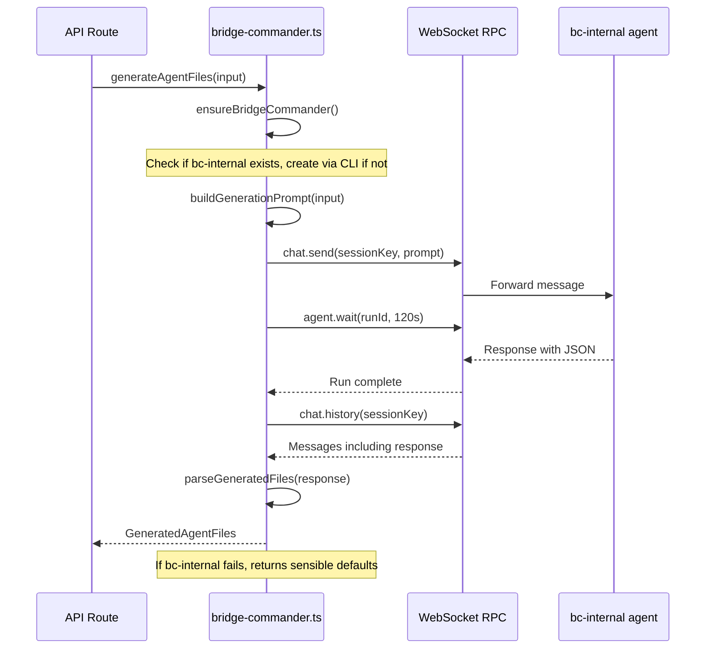

# Agent Creation

## Overview

Bridge Command creates agents through a 4-step wizard. Agents come in two types with different creation paths:

```
                    ┌─────────────────────┐
                    │     Wizard UI       │
                    │  /dashboard/agents/new │
                    └──────────┬──────────┘
                               │
                    ┌──────────▼──────────┐
                    │   Agent Type?        │
                    └──┬───────────────┬──┘
                       │               │
              ┌────────▼──────┐  ┌─────▼────────┐
              │  Full Agent   │  │   Spawnable   │
              │               │  │   Sub-agent   │
              └────────┬──────┘  └─────┬────────┘
                       │               │
              All 4 steps       Steps 1,2,3,4
              Comms toggle      Parent required
              Spawn agents      No comms toggle
              Hooks toggle      No spawn agents
                       │        No hooks toggle
                       │               │
                       └───────┬───────┘
                               │
                    ┌──────────▼──────────┐
                    │  AI Generate?        │
                    └──┬───────────────┬──┘
                       │               │
              ┌────────▼──────┐  ┌─────▼────────┐
              │ POST          │  │ POST          │
              │ /api/agents   │  │ /api/agents/  │
              │ (quick)       │  │ generate      │
              └───────────────┘  └───────────────┘
```

## Wizard Steps

### Step 1 — Identity

| Field | Required | Notes |
|-------|----------|-------|
| Agent Type | Yes | Full Agent or Spawnable Sub-agent |
| Name | Yes | Human-readable, e.g. "Web Researcher" |
| Agent ID | Auto | Generated from name, editable. Lowercase alphanumeric + hyphens |
| Purpose | Yes | What this agent does — used as description and AI generation input |
| Personality | No | Working style / personality traits |

### Step 2 — Model

| Field | Required | Notes |
|-------|----------|-------|
| Model | No | Dropdown from `GET /api/models`, grouped by provider. Falls back to default |
| Workspace | Auto | `~/.openclaw/workspace/{agent-id}`, editable in Advanced section |

### Step 3 — Relationships

**Full Agent:**

| Field | Notes |
|-------|-------|
| Parent Agent | Optional. Dropdown of all agents |
| Communication | Toggle: join the global messaging pool |
| Spawn Agents | Multi-select: which agents this one can spawn |
| Task Hooks | Toggle: enable Bridge Command task callbacks |

**Sub-agent:**

| Field | Notes |
|-------|-------|
| Parent Agent | **Required**. The agent that will spawn this one |

No communication, spawn agents, or hooks options — sub-agents are lightweight task workers.

### Step 4 — Review & Create

Summary of all choices + toggle for AI generation.

## Creation Flow — Quick (no AI)

`POST /api/agents`



**Workspace after quick create (full agent):**
```
~/.openclaw/workspace/{agent-id}/
├── USER.md          ← copied from default agent
└── TOOLS.md         ← BC_TOOLS section with task callbacks
```

**Workspace after quick create (sub-agent):**
```
~/.openclaw/workspace/{agent-id}/
└── TOOLS.md         ← BC_TOOLS section with task callbacks
```

## Creation Flow — AI Generated

`POST /api/agents/generate`



**Workspace after AI create (full agent):**
```
~/.openclaw/workspace/{agent-id}/
├── SOUL.md          ← AI-generated personality and guidelines
├── IDENTITY.md      ← AI-generated name and tagline
├── AGENTS.md        ← AI-generated workspace conventions
├── MEMORY.md        ← AI-generated memory structure
├── HEARTBEAT.md     ← AI-generated periodic tasks
├── USER.md          ← copied from default agent
└── TOOLS.md         ← BC_TOOLS section with task callbacks
```

**Workspace after AI create (sub-agent):**
```
~/.openclaw/workspace/{agent-id}/
├── AGENTS.md        ← AI-generated workspace instructions
└── TOOLS.md         ← BC_TOOLS section with task callbacks
```

## bc-internal (AI Generation Service)

Bridge Command's internal agent for AI-powered file generation. Lazy-bootstrapped — created on first use.



**Prompt structure**: Sends agent name, purpose, personality, peers, parent — asks for a JSON response with keys: `soul`, `identity`, `user`, `agents`, `memory`, `heartbeat`.

**Graceful degradation**: If bc-internal is unavailable, times out, or returns unparseable content, `generateAgentFiles()` returns generic-but-functional default content. The agent is always created regardless.

## Config Changes

Agent creation touches these sections of `~/.openclaw/openclaw.json`:

| Section | When | What |
|---------|------|------|
| `agents.list[]` | Always | New agent entry (via CLI) |
| `tools.agentToAgent.allow` | Full agent + comms enabled | Adds `["*"]` or agent ID to pool |
| `agents.list[].subagents.allowAgents` | Full agent + spawn agents selected | Sets spawn list on new agent |
| `agents.list[parent].subagents.allowAgents` | Sub-agent | Adds new agent to parent's spawn list |
| `hooks.allowedAgentIds` | Full agent + hooks enabled | Allows task callbacks |

## Deletion

`DELETE /api/agents/{id}`

Reverses all creation steps:
- Removes agent from `agents.list`
- Removes from all other agents' `subagents.allowAgents`
- Removes from `tools.agentToAgent.allow`
- Removes from `hooks.allowedAgentIds`
- Removes from hierarchy DB, reparents children to root
- **Does NOT delete workspace files** — they remain on disk

Blocked for the default agent (returns 403).
