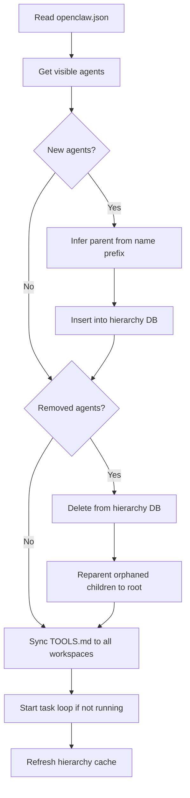
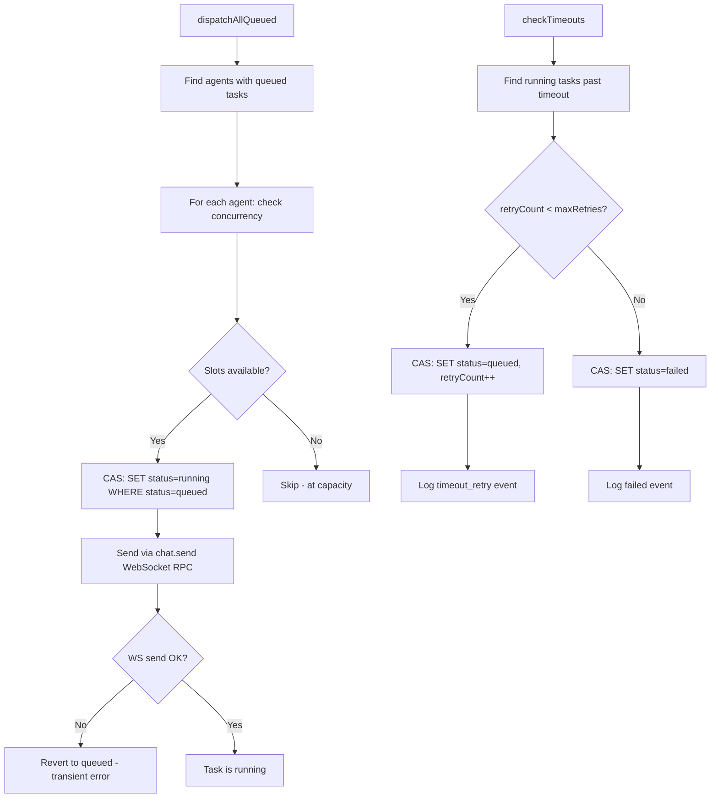
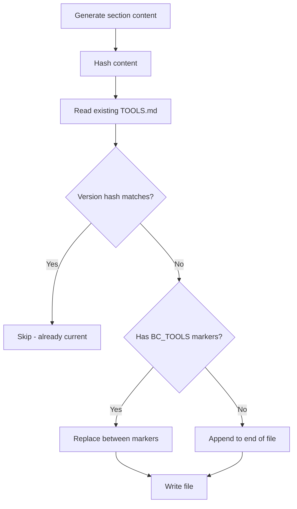
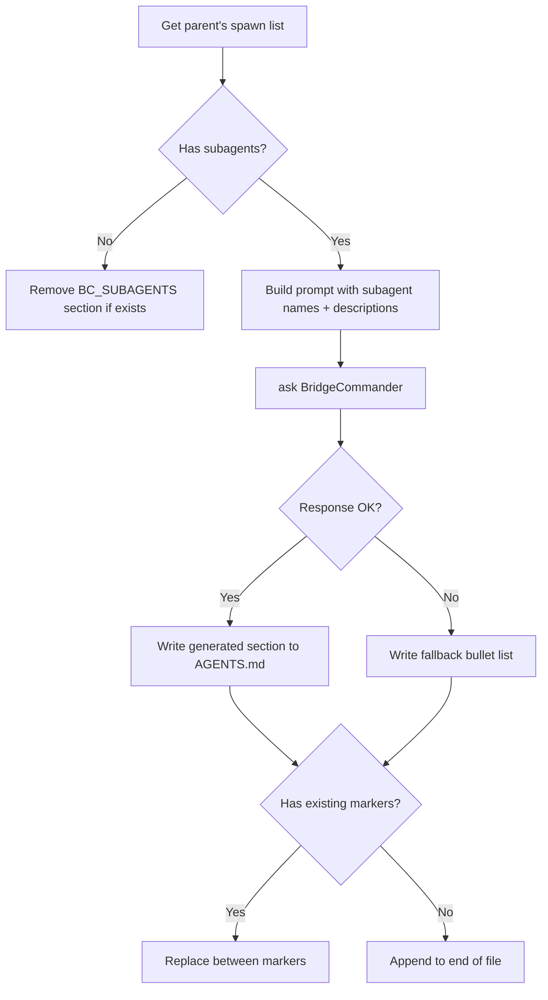
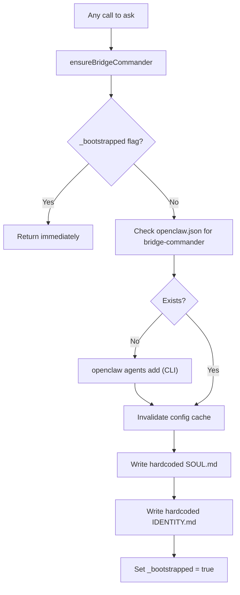
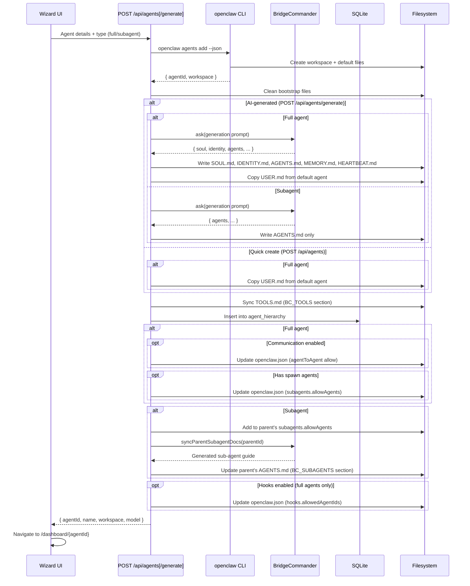

# Bridge Command — Sync Architecture

## Overview

Bridge Command runs two independent background loops plus event-driven syncs that keep everything in sync between OpenClaw's config, the SQLite database, and agent workspace files.

```
┌─────────────────────────────────────────────────────────────────┐
│                     openclaw.json                                │
│              (source of truth for agents)                        │
└──────────┬──────────────────────────────────────┬───────────────┘
           │ read                                  │ read/write
           ▼                                       ▼
┌─────────────────────┐              ┌──────────────────────────┐
│   Agent Sync Loop   │              │    Agent Creation API     │
│   (every 10 min)    │              │  POST /api/agents[/gen]   │
└─────────┬───────────┘              └────────────┬─────────────┘
          │                                        │
          ├─► Add new agents to DB                 ├─► openclaw agents add (CLI)
          ├─► Prune removed agents                 ├─► Write workspace files
          ├─► Reparent orphaned children           ├─► Update hierarchy DB
          └─► Sync TOOLS.md to all workspaces      ├─► Sync TOOLS.md
                                                   ├─► Configure relationships
                                                   └─► Sync parent AGENTS.md
```

## Background Loops

### 1. Agent Sync Loop (every 10 min)

**File**: `src/lib/db/seed.ts`
**Trigger**: Lazily started on first `GET /api/agents/hierarchy`
**Guard**: Recursive `setTimeout` + `_syncRunning` flag (no overlap)



**What it syncs**:
- `agent_hierarchy` table ← `openclaw.json` agents list
- `TOOLS.md` in each agent's workspace ← `bc-tools.ts` generated section

**Filtering**: `isVisibleAgent()` excludes `mc-gateway-*` (OpenClaw internal) and `bridge-commander` (Bridge Command internal).

### 2. Task Loop (every 60s)

**File**: `src/lib/task-dispatcher.ts`
**Trigger**: Started by agent sync loop after first sync
**Guard**: Recursive `setTimeout` + `_loopRunning` flag (no overlap)



**CAS Guards**: Every state mutation uses `WHERE status = <expected>` + checks `result.changes`. Three-way CAS on retry: `WHERE id=? AND retryCount=? AND lastContactAt < cutoff`.

## Event-Driven Syncs

### 3. TOOLS.md Sync

**File**: `src/lib/bc-tools.ts`
**Markers**: `<!-- BEGIN:BC_TOOLS -->` / `<!-- END:BC_TOOLS -->`



**Triggered by**:
- Agent sync loop (all agents, every 10 min)
- Agent creation (`POST /api/agents` and `POST /api/agents/generate`)

**Content**: Bridge Command task callback tools (`task.complete`, `task.update`, `task.fail`, `task.create`) with curl examples pointing to `BC_INTERNAL_URL`.

### 4. Parent Subagent Docs Sync

**File**: `src/lib/bridge-commander.ts` → `syncParentSubagentDocs()`
**Markers**: `<!-- BEGIN:BC_SUBAGENTS -->` / `<!-- END:BC_SUBAGENTS -->`



**Triggered by**:
- Agent creation as subagent (`addToParentSpawnList: true`)
- Spawn list changes via `PATCH /api/agents/{id}` (allowedSubagents)

**Uses BridgeCommander** to generate contextual descriptions of when/why to use each sub-agent. Falls back to a plain list if BridgeCommander is unavailable.

### 5. BridgeCommander Lazy Bootstrap

**File**: `src/lib/bridge-commander.ts` → `ensureBridgeCommander()`



**Triggered by**: First call to `ask()` — which happens on first AI-generated agent creation or first `syncParentSubagentDocs` with BridgeCommander.

## Agent Creation Flow



## File Marker Conventions

| Marker | File | Purpose |
|--------|------|---------|
| `<!-- BEGIN:BC_TOOLS -->` | TOOLS.md | Bridge Command task callback tools |
| `<!-- BC_TOOLS_VERSION: {hash} -->` | TOOLS.md | Content hash for skip-if-unchanged |
| `<!-- BEGIN:BC_SUBAGENTS -->` | AGENTS.md | Available sub-agents guide for parent |

All marker sections are fully managed by Bridge Command — content between markers is overwritten on each sync. Content outside markers is preserved.
